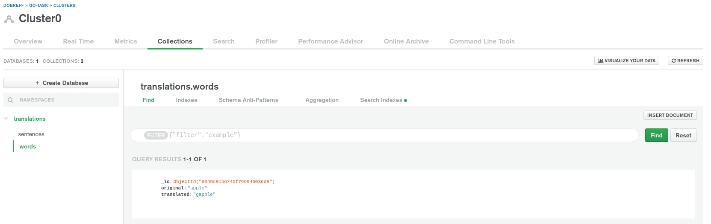
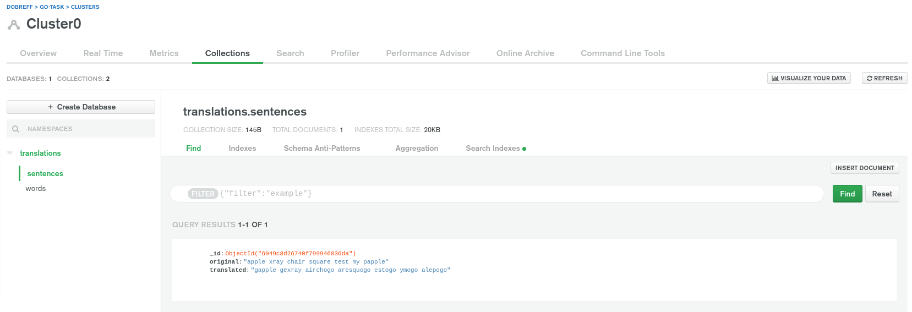

# Go lang task

Made with 💚 by Martin Dobrev

## Instructions

Run code with the following commands:

```
PORT=3000 go run server.go
```

or

```
go run server.go 3000
```

Application should run on `http://localhost:3000/`

### API endpoints

Url:
`/word`

Example body:

```
{
    "english-word": "apple"
}
```

Example response:

```
{
    "gopher-word": "gapple"
}
```



---

Url:
`/sentence`

Body:

```
{
    "english-sentence":"apple xray chair square test my"
}
```

Example response:

```
{
    "gopher-sentence": "gapple gexray airchogo aresquogo estogo ymogo alepogo"
}
```



---

Url:
`/history`

Example response:

```
{
    "history": [
        {
            "apple": "gapple"
        },
        {
            "apple xray chair square test my papple": "gapple gexray airchogo aresquogo estogo ymogo alepogo"
        }
    ]
}
```
